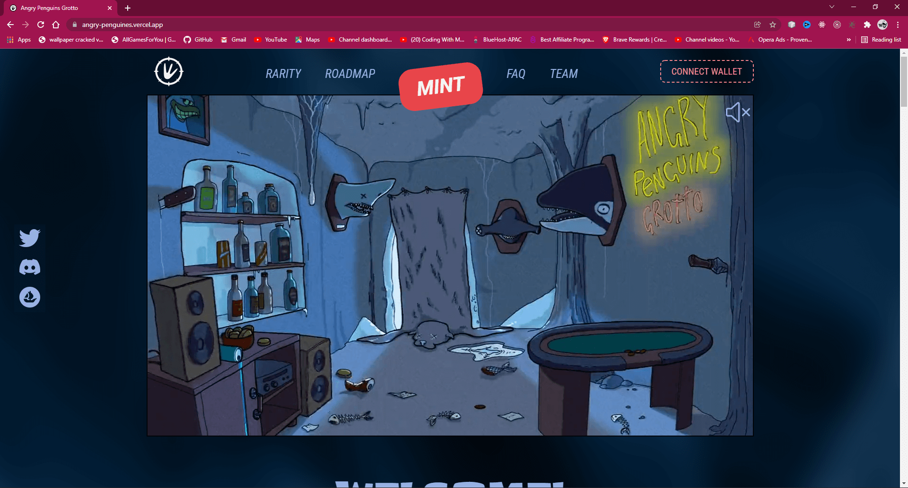

## Angry Penguins

It's a simple web application to know about NFT info.

<h2 align="center">
  <a href="https://angry-penguines.vercel.app/" target="_blank">Angry Penguins NFT</a>
</h2>

  Sample Desktop Application 👇

## Built With

This project was built using these technologies.

- JavaScript
- HTML
- CSS
- jQuery
- VsCode
- Deployed on Vercel

## Features are: 😀

- Search bar to search your characters.
- Mute and Un-mute Button.
- New icons are added to the bottom taskbar.
- Dark background with animation.

### Show your support

📌 Please feel free to contribute to this project with your commits, and share this with your friends if you like this projects.😁 😃

Give a ⭐ if you like this website! Fork it and contribute
